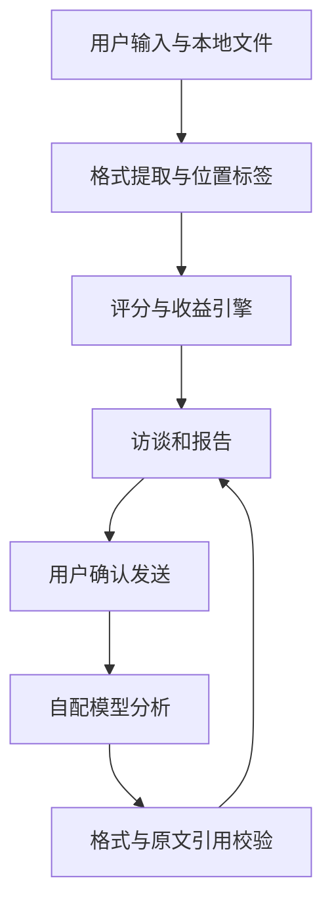

# 产品定义与实现说明

## 已确认的共识

- 对象：员工、部门负责人、企业负责人及顾问，依据岗位与当前目标诊断。
- 范围：13 个业务环节全部进入目录，行为与经济审计贯穿全链条。
- 目标：降本、增收、提效、质量与风险控制，由使用者选择；寻找 30—90 天可验证的机会。
- 交互：手机友好、独立网页链接、GitHub 首页在线入口；无材料也可低证据初筛。
- 输出：前三个候选及全部环节状态、依据、条件缺口、参数化收益情景、试点与验收办法。
- 模型：可选自配接口，提供无配置模拟示例，真实材料发送前确认。

## 架构

静态前端 + 浏览器文档提取 + 确定性评分/测算 + 可选外部模型。GitHub Pages 能完整承载基础功能，不需要持有用户密钥的公共后端。

界面及规则采用原创实现；不直接 fork 一个通用平台。PDF.js 与 fflate 按固定版本随站点托管，避免在用户浏览器运行时依赖第三方 CDN。

## Agent 的边界

基础模式是规则访谈助手：按当前环节、材料有无、已回答维度与风险缺口生成下一条问题。

模型模式执行一个有限的分析循环：读取业务画像与材料摘录 → 生成结构化发现与追问 → 校验格式与引文 → 用户核实并回答 → 再次分析。没有外部工具执行权限，不直接操作业务系统。

输入文档是数据，不是系统指令。模型输出始终按纯文本渲染，HTML 全部转义，不执行脚本或链接。模型推理不能自动成为经验证事实。这里的防护不能保证模型完全不受恶意文本影响，因此评分与资金测算不交给模型，关键结论要求人工确认。

## 可追溯与证据层级

1. 材料线索：关键词匹配，展示文件名和段落/行/页；仅证明相关性。
2. 用户陈述：评分、访谈回答及参数，用户负责确认真实口径。
3. 模型建议：待人工复核；引用匹配表示该文本确实在材料中，不验证推论。
4. 试点实测：首版提供验证步骤，不伪造历史结果；未来可接入基线与运行记录。

修改业务、材料、评分、回答或收益参数后清除旧模型分析，避免把旧结论用于新上下文。

## 全链条而非全自动

每个环节都有针对性候选动作，但“生产制造”不代表自动控制设备，“设计”不代表生成可施工 CAD，“排单”不代表完整运筹求解，“审计”不代表正式责任认定。首版优先评估信息提取、比对、知识检索、异常线索与草稿生成。

跨环节关联必须使用一致订单/批次主键、时间和版本。首版展示关联检查方向及材料覆盖，不从关键词自动推断实体级关联，也不直接给全企业收益加总。

## 验收

- 15 个诊断维度无遗漏；用户可切换目标，未知项不被计作成熟或失败。
- 无密钥能体验并完整使用规则诊断；无材料结果清楚表示缺口。
- 文件提取有位置与限额，坏文件、扫描 PDF、超限文件有明确反馈。
- 模型需用户主动发送，发送前可查看完整正文，取消、超时、HTTP 与解析失败可恢复。
- 引用必须匹配实际 sourceId 及原文；未验证内容不冒充材料证据。
- 复核耗时、兑现比例、初始投入及运行成本参与测算；不正的净收益不产生虚假回本期。
- 导出包含方法、参数、依据与限制，不含密钥。
- 移动端布局适配，输入使用不小于 16px 字号，按钮可触控，提供键盘焦点和语义标签。

## 后续演进

优先用真实匿名案例校准评分与追问效果，再考虑可选私有后端（如 Docling/OCR）、基于订单主键的结构化比对、组织协作和试点实测闭环。不得将这些后续能力表述为当前已交付。
