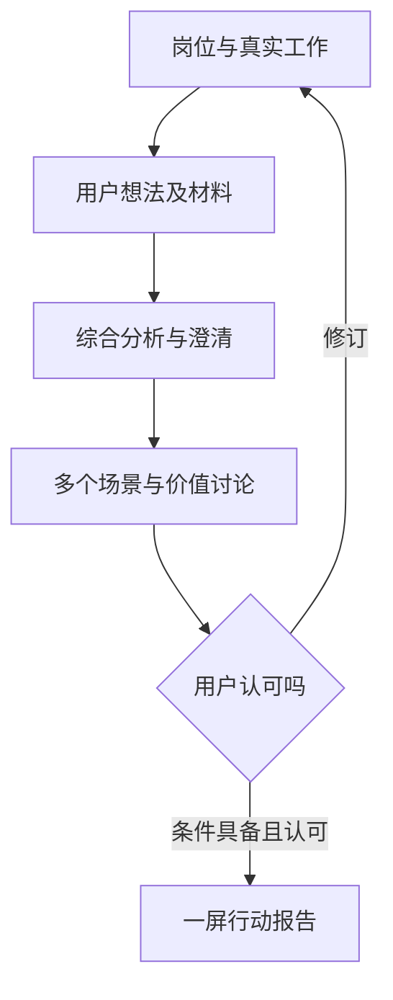

# v0.2：通过对话形成共识

## 产品约定

先理解用户在组织中的位置，再问职责权限、工作输入输出、作业方法、技能工具与数据、绩效基线。邀请用户提出自己的AI想法，明确期望形式、目标与限制，收集材料。综合分析后继续澄清，比较多个场景，逐个验证条件及价值。用户可随时修改任何一项，循环沟通，最终自己确认可行。

主页面一次一个问题；15个环节的导航和评分表从主界面移除。完整画像、历史记录、材料和行业依据按需展开。最后聚焦一个优先试点，生成六行一屏报告；多个候选和详细测算仍可返回查看，不挤进报告。

## 当前实现

静态HTML/CSS/JavaScript，发布在GitHub Pages。`interview.js`负责访谈状态、匹配、解释性分级和一屏报告；`industry.js`保存公开来源及环节追问；`app.js`负责交互与模型接入；`parsers.js`提取浏览器本地材料。`core.js`保留全链条目录和v0.1兼容算法，旧加权评分不再用于v0.2页面。

本地模式是规则引导：基础访谈之后，依据岗位/任务/想法关键词匹配场景，结合关联材料提出行业追问。它不冒充开放式语言理解或自动文档审单。用户可手动选择所有15个环节并修订场景名称、协作动作、目标、条件、形式及路线。

可选模型模式：用户连接兼容接口，并授权本轮访谈发送到该服务后，回答会触发模型分析和一条进一步的问题。模型看到岗位回答、最近24条对话、最多60,000字符材料及行业知识。场景页也可主动请求综合分析。模型输出按结构校验；引文须在指定文件中逐字存在，其他观察保留“需验证”。模型不能替用户确认条件、填收益数字或确认报告。

用户修正画像后清除各场景旧条件确认；修改材料、参数或报告后清除旧报告认可及旧模型分析。场景之间参数独立，不把一个环节的收益套到另一个环节。

## 分级逻辑

这是可解释的试点筛选规则，未经行业实证校准，不是成功概率。

| 等级 | 判断条件 |
|---|---|
| 超级适合且价值明显 | 四项条件均确认；有相关材料且用户确认口径和代表性；参数由用户标记实测；月工时收益达到用户自定的正阈值；月现金净收益为正 |
| A · 适合，优先试点 | 四项条件确认、工时收益为正；仍有样本、实测或完整经济性待验证 |
| B · 有条件适合 | 条件未知/部分缺失，或还没有足够测算参数；缺少信息不等于D |
| C · 暂不优先 | 工时收益不为正、月现金净收益为负，或当前无法启动试点 |
| D · 当前方式不适合 | 业务生效前无法复核及阻断错误，应改变应用方式 |

四项条件：可授权使用的数据、明确规则与验收、复核及责任、可启动的试点方式。用户用简短选项确认状态并说明依据。判定次序：D控制门槛→C价值或实施门槛→B缺口→S/A。现场实测、几何/数控、设备控制、质量放行与正式审计责任仍由专业人员或专用系统负责。

## 测算

月净节省工时 = 月任务量 × 覆盖率 ×（原耗时 − AI使用后总耗时）÷ 60。AI使用后耗时必须含准备、等待、处理和复核。空出的时间是能力释放，不默认转成工资节约。

月现金净收益 = 正的工时价值 × 可兑现比例 − 月费用；如果增加工时，按全额新增人工成本扣除。静态回本 = 一次性投入 / 正的月净收益。未知参数留空，不使用演示数值填充。不涉及的金额需用户明确填0。

质量、风险与增收先通过用户的绩效指标验收，当前版本不自动把它们货币化。收益场景不直接加总，避免共享工时重复计算。没有正的现金净收益时不展示虚假回本周期，但现金为0、工时为正的免费辅助方案仍可能是A。

## 一屏报告与共识

报告六项：场景与目标、人机协作、价值与验收、必要条件、应用形式、技术路线。控制单项文本长度，超长摘要标明省略号；完整访谈保留原文，可由用户修订成简短精确表达。报告卡本身针对手机一屏设计，设置、历史和比较位于卡外。

只有用户主动勾选认可、四项条件具备、完成有效测算且不是C/D，才显示“用户已确认可行”。这记录用户的试点判断，不代表工具保证效果。条件不足时仍可导出标明“讨论稿”的报告。

## 隐私与保存

默认内存会话；主动保存到本机才写localStorage，包含材料摘录。JSON导出可保留完整访谈供查看，当前未实现JSON重新导入或多人同步。密钥仅在页面内存；恢复会话需重新连接。v0.1本机数据不会自动迁移或被新版错误解读；主动清空会一并删除两版保存。

模型按本轮明确授权发送，可查看当前payload，随时断开；无需每条消息重复授权。未授权时无模型请求。协议与凭证检查、禁止重定向、请求超时、响应格式及引文检查、HTML转义和CSP约束降低风险，但不能代替企业部署隔离或业务复核。

## 验证与边界

自动化覆盖画像访谈→澄清→多个候选→场景条件→数值测算→显式确认→修改再沟通，也覆盖等级边界、负收益、未填数字、材料提取、假引文、模型HTTP失败、转义、存储与密钥隔离。模型交互以模拟接口验证协议和错误恢复；真实模型需用户提供服务和额度。

不是现成ERP/MES集成、OCR、自动CAD拆单、自动排产、实际审计引擎或企业级多人系统。可在真实匿名试用中进一步校准追问、评价和试点基线。
